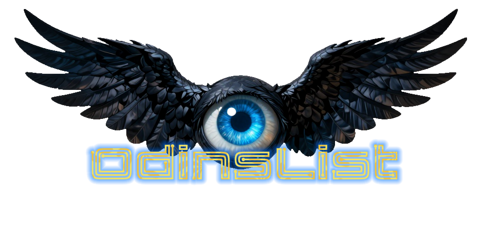

# OdinsList
<p align="center">
  
</p>

<h1 align="center">OdinsList</h1>
<p align="center"><em>Automated comic cataloging from cover images</em></p>

OdinsList is an automated comic cataloging tool that identifies issues directly from cover images using a vision-language model, then cross-references results with the Grand Comics Database and the ComicVine API to generate structured, high-confidence collection data with minimal manual entry.

## Quick Start

```bash
# 1. Clone and install (into uv venv recommended)
git clone https://github.com/yourusername/odinslist.git
cd odinslist
pip install -r requirements.txt

# 2. Configure (copy .env.example to .env and fill in your keys, endpoint, and model name)
cp .env.example .env

# 3. Start your VLM server (example with vLLM)
vllm serve lhoang8500/Qwen3-VL-8B-Instruct-NVFP4 --port 8000

# 4. Run on a single box
python OdinsList.py --images /path/to/Comic_Photos --box Box_01

# 5. Or process everything at once
python OdinsList.py --images /path/to/Comic_Photos --batch
```

## Features

- **Vision-based extraction**: Uses vision language models to read comic covers and extract metadata
- **Multi-database verification**: Cross-references the Grand Comics Database (local SQLite) first, and then ComicVine API if a local match is not found
- **Visual cover matching**: Compares your cover photo against database covers (only if escalated to ComicVine API) to verify matches
- **Confidence scoring**: Each result includes a confidence level (high/medium/low) based on match quality
- **Batch processing**: Process entire collections organized in box folders
- **Resume capability**: Skip already-processed high-confidence matches on re-runs (works in both single-box and batch mode)
- **Price-based year estimation**: Uses cover price to narrow down publication year ranges in DB searches
- **Multi-format support**: Accepts JPG, PNG, TIFF, WebP, and BMP images

## How It Works

```
┌─────────────────┐     ┌─────────────────┐     ┌─────────────────┐
│  Cover Photo    │────▶│  Vision Model   │────▶│  Extracted      │
│  (image file)   │     │  (Qwen-VL)      │     │  Metadata       │
└─────────────────┘     └─────────────────┘     └────────┬────────┘
                                                         │
                        ┌────────────────────────────────┼────────────────────────────────┐
                        ▼                                ▼                                ▼
               ┌─────────────────┐             ┌─────────────────┐             ┌─────────────────┐
               │  GCD Database   │             │  ComicVine API  │             │  Visual Match   │
               │  (Local SQLite) │             │  (Remote)       │             │  (Cover Compare)│
               └────────┬────────┘             └────────┬────────┘             └────────┬────────┘
                        │                               │                                │
                        └───────────────────────────────┴────────────────────────────────┘
                                                        │
                                                        ▼
                                               ┌─────────────────┐
                                               │  Scored Results │
                                               │  (TSV Output)   │
                                               └─────────────────┘
```

1. **Vision Extraction**: A VLM analyzes the cover image and extracts visible text/metadata
2. **Local Database Search**: Searches the Grand Comics Database (no API calls, instant)
3. **API Verification**: Cross-references with ComicVine for additional data and cover images if a local match cannot be found in GCD DB
4. **Visual Comparison**: Compares your photo against ComicVine covers to confirm matches
5. **Scoring**: Combines all signals into a confidence score

## Requirements

- Python 3.10+
- A vision-capable language model (see [Supported Models](#supported-models))
- ComicVine API key (free at [comicvine.gamespot.com](https://comicvine.gamespot.com/api/))
- Grand Comics Database dump (https://docs.comics.org/wiki/Main_Page#Database)

## Setup

### 1. Clone the repository

```bash
git clone https://github.com/yourusername/odinslist.git
cd odinslist
```

### 2. Install dependencies

```bash
pip install -r requirements.txt
```

### 3. Configure environment

Copy the example env file and fill in your values:

```bash
cp .env.example .env
```

Edit `.env`:
```
COMICVINE_API_KEY=your-api-key-here
VLM_BASE_URL=http://127.0.0.1:8000/v1
VLM_MODEL=lhoang8500/Qwen3-VL-8B-Instruct-NVFP4
```

Get a free ComicVine API key at [comicvine.gamespot.com/api](https://comicvine.gamespot.com/api/).

### 4. Set up your vision model

OdinsList uses an OpenAI-compatible API endpoint. You can use:

- **vLLM** with a vision model (recommended for local)
- **Ollama** with LLaVA or similar
- **LM Studio**
- Any OpenAI-compatible vision API

Example with vLLM:
```bash
vllm serve lhoang8500/Qwen3-VL-8B-Instruct-NVFP4 --port 8000
```

### 5. (Optional) Set up Grand Comics Database

The local GCD DB significantly improves accuracy and speed and reduces API calls to ComicVine:

1. Download the latest SQLite dump from [comics.org/download](https://www.comics.org/download/)
2. Place the `.db` file in your images directory (auto-detected) or pass `--gcd-db /path/to/file.db`

## Usage

### Directory Structure

Organize your comic photos in box folders:

```
Comic_Photos/
├── Box_01/
│   ├── IMG_0001.jpg
│   ├── IMG_0002.png
│   └── ...
├── Box_02/
│   └── ...
└── Box_03/
    └── ...
```

### Single Box Mode

```bash
python OdinsList.py --images /path/to/Comic_Photos --box Box_01
```

Output: `Comic_Photos/Box_01/Box_01.tsv`

### Batch Mode

Process all boxes at once:

```bash
python OdinsList.py --images /path/to/Comic_Photos --batch
```

Output: `Comic_Photos/odinslist_output.tsv`

### Resume After Interruption

If a run is interrupted, re-run with `--resume` to skip high-confidence matches:

```bash
python OdinsList.py --images /path/to/Comic_Photos --batch --resume
```

### CLI Reference

| Flag | Description | Default |
|------|-------------|---------|
| `--images` | Base(parent) directory with Box_XX folders | required |
| `--box` | Process a single box | (mutually exclusive with --batch) |
| `--batch` | Process all Box_XX folders | False |
| `--out` | Output TSV path | auto-generated in images dir |
| `--resume` | Skip high-confidence matches from previous runs | False |
| `--gcd-db` | Path to GCD SQLite database | auto-detect `*.db` in images dir |
| `--vlm-url` | VLM API base URL | env `VLM_BASE_URL` or `http://127.0.0.1:8000/v1` |
| `--vlm-model` | VLM model name | env `VLM_MODEL` |
| `--no-gcd` | Disable local GCD search | False |
| `--no-comicvine` | Disable ComicVine API (GCD-only mode) | False |
| `--no-visual` | Disable cover image comparison | False |

Precedence: CLI flag > environment variable > default.

## Output Format

Results are saved as tab-separated values (TSV):

| Column | Description |
|--------|-------------|
| title | Comic series title |
| issue_number | Issue number (e.g., `142`) |
| month | Cover month as 3-letter abbreviation (e.g., `MAR`) |
| year | Publication year |
| publisher | Publisher name (normalized) |
| box | Box folder name |
| filename | Original image filename |
| notes | Empty — reserved for your manual annotations |
| confidence | Match confidence: high, medium, or low |

### Confidence Levels

- **high** (score > 40): Strong match, likely correct
- **medium** (score 20-40): Probable match, worth verifying
- **low** (score < 20): Uncertain, manual review recommended

## Supported Models

Any vision-capable model served via OpenAI-compatible API:

| Model | Notes |
|-------|-------|
| Qwen2-VL / Qwen3-VL | Tested and recommended, excellent OCR |
| LLaVA 1.6+ | Good general performance |
| InternVL2 | Strong multilingual support |
| Pixtral | Mistral's vision model |

Set the model via `--vlm-model` flag or `VLM_MODEL` in your `.env` file.

## Accuracy

In testing on a collection of ~3,000 comics:
- **~94% accuracy** with high-confidence matches

### Tips for Better Results

- Take photos in good lighting with minimal glare
- Capture the full cover including edges
- Avoid extreme angles
- Higher resolution photos improve OCR accuracy

## Data Sources

### Grand Comics Database (GCD)

- **Website**: [comics.org](https://www.comics.org/)
- **License**: [CC BY 3.0](https://creativecommons.org/licenses/by/3.0/)
- **Coverage**: Comprehensive database of published comics worldwide

### ComicVine

- **Website**: [comicvine.gamespot.com](https://comicvine.gamespot.com/)
- **API**: Free tier allows 200 requests/hour
- **Coverage**: Extensive US comics database with cover images

## Roadmap

- [ ] Configuration file support (YAML/TOML)
- [ ] Multiple model provider support (Anthropic, Google, etc.)
- [ ] Web UI for non-technical users
- [ ] JSON output format
- [ ] Docker container with bundled model

## Contributing

Contributions welcome! Areas where help is needed:

- Testing with different vision models
- Improving title matching algorithms
- Adding support for non-US and oddball comics
- Documentation and examples

## License

[MIT License](LICENSE)

## Acknowledgments

- [Grand Comics Database](https://www.comics.org/) for their comprehensive open data
- [ComicVine](https://comicvine.gamespot.com/) for their API and cover images
- The open-source VLM community

---

*Let the all-seeing eye of Odin simplify cataloging your comics*
