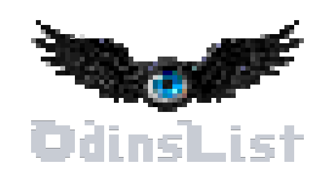

<p align="center">
  
</p>

# OdinsList

OdinsList is an automated comic cataloging tool with an interactive TUI built on [OpenTUI](https://github.com/anthropics/opentui). It identifies issues directly from cover images using a vision-language model, then cross-references results with the Grand Comics Database and ComicVine to generate structured, high-confidence collection data with minimal manual entry.

Version: `0.2.3`

## How It Works

- **Vision-based extraction** — Uses a vision-language model to read comic covers and extract metadata
- **Multi-database verification** — Checks the local GCD SQLite database first, then uses ComicVine when needed. OdinsList can run with either source independently, but best accuracy and coverage come from enabling both
- **Visual cover matching** — Compares your cover image against database cover art during ComicVine validation for tougher matches
- **Confidence scoring** — Each result is labeled `high`, `medium`, or `low` (see [Confidence Levels](#confidence-levels))
- **Batch processing** — Processes full collections organized into box folders
- **Resume capability** — Pause anytime and resume from any existing TSV
- **Multi-format image support** — Supports `.jpg`, `.jpeg`, `.png`, `.tiff`, `.tif`, `.webp`, and `.bmp`

## Requirements

- Linux or macOS (`x64` or `arm64`) for release binaries
- Python `3.10+` (required for backend setup on first run)
- A running OpenAI-compatible VLM API endpoint (for example: `http://127.0.0.1:8000/v1`)
- ComicVine API key (free at [comicvine.gamespot.com/api](https://comicvine.gamespot.com/api/))
- GCD SQLite `.db` file (free at [comics.org/download](https://www.comics.org/download/))

> **For best results, enable both GCD and ComicVine.** The local GCD database provides fast offline lookups for the majority of matches, while ComicVine handles edge cases and confirms uncertain matches through visual cover comparison.

## Quick Start

1. Install OdinsList:

```bash
curl -fsSL https://raw.githubusercontent.com/boyobob/OdinsList/main/install.sh | bash
```

2. Start your VLM server (VLM Configuration Note: OdinsList sends each image as an independent, single-turn request with no conversation history. For best results, disable any multi-modal KV cache on your VLM server (e.g., --mm-processor-cache-gb 0 in vLLM) so each cover is evaluated fresh, cached multi-modal context can degrade accuracy.)


3. Launch OdinsList:

```bash
odinslist
```

4. Complete first-run setup/installation, then open `Settings` to configure:

   - VLM API endpoint (`vlm_base_url`) ex: (http://127.0.0.1:8000/v1)
   - Model name (`vlm_model`) ex: (Qwen/Qwen3-VL-8B-Instruct-FP8)
   - ComicVine API key
   - GCD SQLite DB local path (If you place this in your images parent directory the program will autodetect it, you can place it anywhere so long as you define the path)

5. Select `Start New Run` and choose your parent image directory (example: `~/Desktop/Comic_Photos`). 

Note: For the program to recognize your image folders you must use the `Box_##` naming convention for folders in parent directory. The parent directory can be named anything.

```text
/path/to/comics/
├── Box_01/
│   ├── 0001.jpg
│   └── 0002.png
├── Box_02/
│   └── 0001.webp
└── my_gcd.db
```

6. Choose mode:

   - `Single Box` — process one folder such as `~/Desktop/Comic_Photos/Box_01`
   - `Batch` — process all valid box folders under the parent directory

7. Pick the output TSV path/name (default is pre-filled, but editable), review the pre-run summary, and start.

8. During an active run:

   | Key | Action |
   |-----|--------|
   | `P` | Pause the run |
   | `Enter` | Resume from pause |
   | `B` | Toggle browse mode to review results as they arrive |
   | `Esc` `Esc` | Exit to main menu |

   > You can safely exit the program at any time — your progress is saved. To pick up where you left off, select `Resume Run` from the main menu and select which TSV you would like to resume from.

### Directory Structure

Organize your comic photos in box folders. Folders must use the `Box_XX` naming convention. The parent directory can be named anything.

```text
/path/to/comics/
├── Box_01/
│   ├── 0001.jpg
│   └── 0002.png
├── Box_02/
│   └── 0001.webp
└── my_gcd.db
```

## Headless CLI Usage/Reference

Use `--box` or `--batch` to run without the TUI.

### Batch Scan All Boxes

```bash
odinslist \
  --images /path/to/comics \
  --batch \
  --out /path/to/comics/All_Boxes.tsv \
  --vlm-url http://127.0.0.1:8000/v1 \
  --vlm-model Qwen2.5-VL-32B
```

### Single Box Scan

```bash
odinslist \
  --images /path/to/comics \
  --box Box_01 \
  --out /path/to/comics/Box_01.tsv \
  --vlm-url http://127.0.0.1:8000/v1 \
  --vlm-model Qwen2.5-VL-32B
```

### Resume Previous TSV

```bash
odinslist \
  --images /path/to/comics \
  --batch \
  --out /path/to/comics/All_Boxes.tsv \
  --resume
```

### CLI Reference

| Flag | Description | Default |
|------|-------------|---------|
| `--images` | Parent directory with `Box_XX` folders | *required* |
| `--box` | Process a single box | *(mutually exclusive with --batch)* |
| `--batch` | Process all `Box_XX` folders | `false` |
| `--out` | Output TSV path | auto-generated in images dir |
| `--resume` | Skip high-confidence matches from previous runs | `false` |
| `--gcd-db` | Path to GCD SQLite database | auto-detect `*.db` in images dir |
| `--vlm-url` | VLM API base URL | `http://127.0.0.1:8000/v1` |
| `--vlm-model` | VLM model name | from config |
| `--no-gcd` | Disable GCD lookups | `false` |
| `--no-comicvine` | Disable ComicVine lookups | `false` |
| `--ipc` | Run JSONL IPC mode (used by the TUI backend) | `false` |

If `--gcd-db` is omitted, OdinsList auto-detects the newest `.db` file in the images root when possible.

## Configuration File

OdinsList stores config at `~/.config/odinslist/config.toml`:

```toml
[paths]
input_root_dir = "/path/to/comics"
output_tsv_path = "/path/to/comics/All_Boxes.tsv"
gcd_db = "/path/to/gcd.db"

[vlm]
base_url = "http://127.0.0.1:8000/v1"
model = "Qwen/Qwen3-VL-8B-Instruct-FP8" (Note: Use the model's exact full name identifier) 

[comicvine]
api_key = "your_ComicVine_API_key"

[features]
gcd_enabled = true
comicvine_enabled = true

[run]
run_mode = "batch"
single_box_dir = ""
```

## Output

Results are written as TSV with columns:

| Column | Description |
|--------|-------------|
| `title` | Comic series title |
| `issue_number` | Issue number (e.g., `142`) |
| `month` | Cover month as 3-letter abbreviation (e.g., `MAR`) |
| `year` | Publication year |
| `publisher` | Publisher name (normalized) |
| `box` | Box folder name |
| `filename` | Original image filename |
| `notes` | Empty — reserved for your manual annotations |
| `confidence` | Match confidence: `high`, `medium`, or `low` |

When rerunning with the same output TSV, rows are updated by `(box, filename)` so scans can be resumed without duplicate lines.

### Confidence Levels

| Level | Score | Meaning |
|-------|-------|---------|
| **high** | > 40 | Strong match, likely correct |
| **medium** | 20–40 | Probable match missing signals, recommend verifying |
| **low** | < 20 | Uncertain, manual review recommended |

## Supported Models

Any vision-capable model served via an OpenAI-compatible API:

| Model | Notes |
|-------|-------|
| Qwen2-VL / Qwen3-VL / Qwen3.5| Tested and recommended, excellent OCR |
| LLaVA 1.6+ | Good general performance |
| InternVL2 | Strong multilingual support |
| Pixtral | Mistral's vision model |

Set the model via `--vlm-model` flag or `vlm.model` in your config file or settings menu.

## Tips for Better Results

- Take photos in good lighting with minimal glare
- Capture the full cover including edges
- Avoid extreme angles
- Higher resolution photos improve OCR accuracy
- When all signals (title, issue#, month, price, publisher) are visible on the cover the program is most accurate. Comics with no signals will likely fail.

## Data Sources

- **Grand Comics Database (GCD)** — [comics.org](https://www.comics.org/) — [CC BY 3.0](https://creativecommons.org/licenses/by/3.0/)
- **ComicVine** — [comicvine.gamespot.com](https://comicvine.gamespot.com/) — Free API tier (200 requests/hour)

## Contributing

Contributions welcome! Areas where help is needed:

- Testing with different vision models
- Improving title matching algorithms
- Adding support for non-US and oddball comics
- Documentation and examples
- Integrating a small bundled OCR model
- Support for variant classification (Newstand etc.) 

## License

MIT. See [LICENSE](LICENSE).

## Acknowledgments

- [Grand Comics Database](https://www.comics.org/) for their comprehensive open data
- [ComicVine](https://comicvine.gamespot.com/) for their API and cover images
- The open-source VLM community

---

*Let the all-seeing eye of Odin simplify cataloging your comics*
